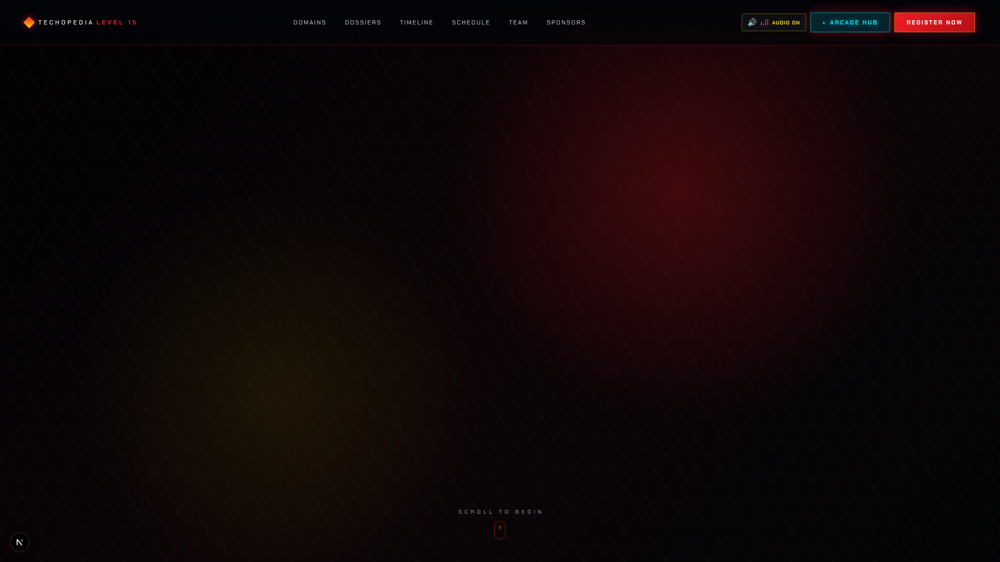
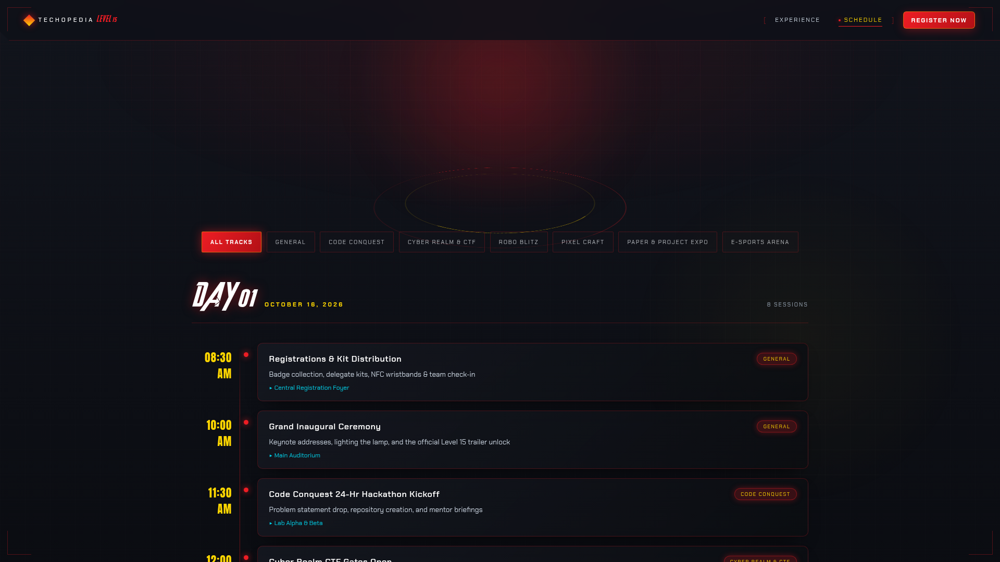
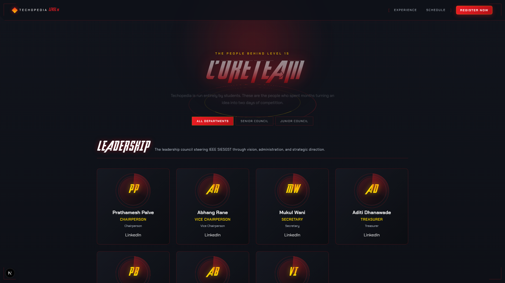
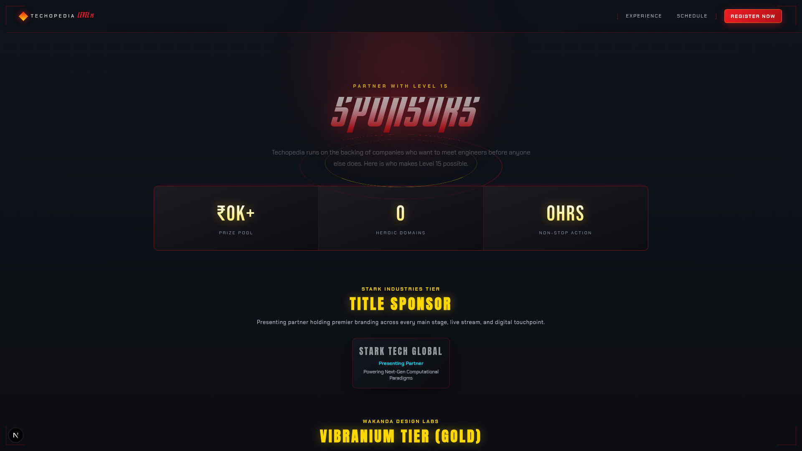
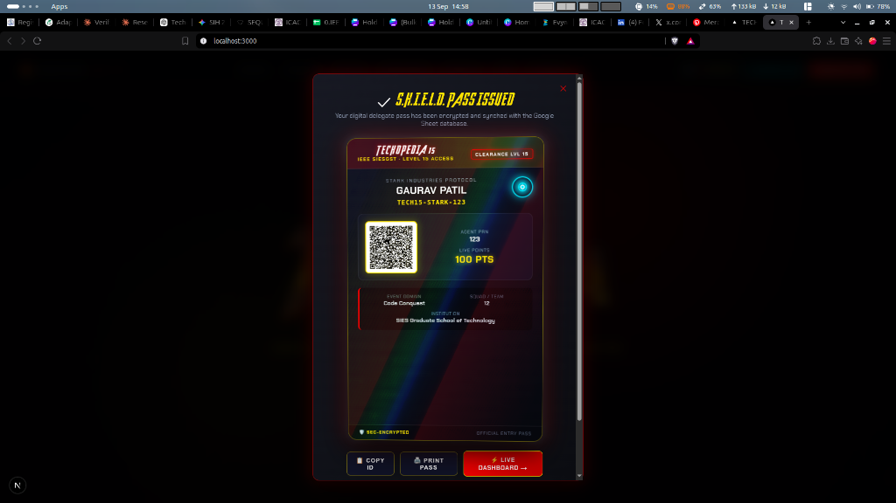

# ⚡ IEEE Techopedia Level 15 — Full Platform Analysis & Architectural Dossier

> **Official Technical Fest Web Platform for IEEE SIESGST**  
> **Theme:** Marvel Multiverse / Stark Industries Command Center  
> **Stack:** Next.js 16 (App Router, Turbopack), React 19, TypeScript, Three.js, React Three Fiber, GSAP, Lenis, Web Audio API, Vanilla CSS Modules.

---

## 1. Executive Summary

**Techopedia Level 15** is a national-level technical symposium organized by the **IEEE SIESGST Student Branch**. This platform serves as the central digital ecosystem for the two-day event (October 16–17, 2026), orchestrating:
1. **Interactive Participant Onboarding** — Multi-domain registration with automated Marvel codename assignment (`TECH15-STARK-XXXX`, `TECH15-PANTHER-XXXX`, etc.) and high-contrast scannable QR ticket generation.
2. **3D Holographic Digital ID Pass** — Physics-based 3D tilt card with holographic sheen, live battle points, instant Retina PNG export (`💾 SAVE PASS`), and outdoor sunlight scanning modal.
3. **Multiverse Live Leaderboard** — Golden-spiral SVG bubble constellation, Hall of Champions Top-3 podium, and real-time activity feed with mobile card-row layout.
4. **Organizer Stall QR Scanner** — Secure coordinator passcode gate, rear-camera live scanner, point allocator (`+50` to `+250 PTS`), offline retry queue (`scanQueue.ts`), and live Google Sheets cloud dispatch.
5. **Automated Ticket Delivery** — S.H.I.E.L.D.-themed HTML email confirmations with embedded QR codes, browser preview fallbacks, and CSV report export.

---

## 2. Visual Architecture & Page Breakdown

### 2.1 Command Center (`/`)
The landing experience immerses visitors in a cinematic Stark Industries HUD with real-time WebGL effects and dynamic audio.

- **Cinematic WebGL Canvas (`components/webgl/CinematicCanvas.tsx`)**:
  - Dynamically code-split via `next/dynamic` (`ssr: false`) to keep the initial client bundle lightweight.
  - Three.js particle storm, volumetric crimson fog, and procedural red lightning shaders responding to scroll position.
- **Story Stack (`components/overlays/StoryStack.tsx`)**:
  - Scroll-linked comic panel progression detailing the multiverse threat.
  - Smooth Lenis momentum scrolling synchronized with GSAP timelines.
- **Character Orbit (`components/overlays/CharacterOrbit.tsx`)**:
  - 3D circular domain carousel featuring loop videos (`char-doom.mp4`, `char-stark.mp4`, etc.).
  - Selecting a card opens the **Event Dossier Modal** with direct domain registration handoff.
- **HUD Audio Engine (`lib/audio.ts`)**:
  - Web Audio API synthesizer generating real-time blips, hums, and success chimes without external audio asset weight.
  - Global mute toggle (`SoundToggle.tsx`) persisted in `localStorage`.


*Figure 1: Command Center home page showing Stark HUD aesthetic, live countdown, and WebGL backdrop.*


*Figure 2: Story stack comic narrative transition.*

---

### 2.2 Event Schedule & Arena Timeline (`/schedule`)
A structured dual-day program breakdown across the 6 competitive domains:

- **Interactive Day Switcher**: Toggle between Day 1 (Hackathons, CTF Round 1, Robo Arena) and Day 2 (Final Pitches, Speed UI Jam, E-Sports Finals, Award Ceremony).
- **Domain Filter Badges**: Filter events dynamically by track.
- **Mobile Stack**: Timeline entries collapse cleanly without layout collision on narrow screens.
- **Header Parity**: Features desktop and mobile navigation with `SoundToggle` and quick registration button.


*Figure 3: Event schedule timeline with domain category tags and time slots.*

---

### 2.3 Core Organizing Committee (`/team`)
Showcases the volunteer organizing team behind Techopedia Level 15:

- **Department Filtering**: Animated Framer Motion tab pill transitioning between *All Departments*, *Senior Council*, and *Junior Council*.
- **Radar Tilt Cards (`components/ui/TiltCard.tsx`)**: 3D interactive member cards featuring MCU-inspired role titles, college roll/post, social links, and fallback initials avatar ring.


*Figure 4: Core team directory with department filters and radar tilt cards.*

---

### 2.4 Sponsors & Industry Partners (`/sponsors`)
A dedicated corporate partnership portal highlighting event reach and sponsor tiers:

- **Tier Scale Grid Hierarchy**:
  - **Title Sponsor (`.xl`)**: Flagship spotlight placement for Stark Tech Global.
  - **Vibranium Tier (`.lg`)**: 3-column gold partner showcase.
  - **Pym Tech Tier (`.md`)**: Silver platform and tooling sponsors.
  - **Community & Media (`.sm`)**: Student chapter and media network cards.
- **Key Metrics**: Live animated stats counter (`CountUp.tsx`) showcasing 1,500+ attendees and 48 hours of competition.


*Figure 5: Sponsors page with tier-scaled logo pedestals and partnership deliverables.*

---

### 2.5 Live Multiverse Leaderboard (`/leaderboard`)
The live ranking engine driving competition engagement across campus:

- **Hall of Champions (Top 3 Podium)**: Gold (`#1`), Silver (`#2`), and Bronze (`#3`) podium pedestals highlighting top scores and colleges.
- **Bubble Node Universe**: Deterministic SVG golden-spiral graph where node radii scale proportionally to battle points (`radius = 18 + sqrt(points) * 1.35`). Hovering over any bubble reveals an interactive HUD dossier.
- **Mobile Card-Row Layout (<680px)**:
  - On desktop: Full 8-column tabular layout.
  - On mobile (`≤ 680px`): Automatically morphs into CSS-grid HUD cards with zero horizontal overflow.
- **Live Activity Ticker**: Floating green pulse toast announcing real-time point allocations across stalls.
- **Network-Aware Polling**: Auto-refreshes every 7 seconds, pausing automatically when the browser tab is hidden (`document.hidden`) or offline.

---

### 2.6 Participant Dashboard & Digital ID Card (`/dashboard/[id]`)
The personal portal every participant accesses by scanning their pass or following their confirmation link:

- **Holographic 3D Digital ID Pass (`components/ui/DigitalIdCard.tsx`)**:
  - Realistic gyro/mouse tilt physics with dynamic glare sheen.
  - Stark Industries protocol branding, Arc Reactor icon, clearance level, participant name, PRN, domain, team, and institution.
  - High-contrast QR code generated at Level H error correction.
  - Security barcode strip with verification stamp (`SEC-AUTH-[PRN]`).
- **`💾 SAVE PASS` (High-Res Native Canvas Exporter)**:
  - Client-side, zero-dependency HTML5 `<canvas>` rendering engine running at **2x Retina resolution (1280 × 1720 px)**.
  - Renders all frames, branding, QR pass, and metadata directly to `Techopedia15_Pass_[PRN].png` for offline photo gallery storage.
- **Full-Screen Sunlight QR Modal**:
  - Tapping the pass QR expands into a full-viewport, pure-white modal (`min(78vw, 78vh, 460px)`) with crisp black typography, safe-area aware close button, and background scroll lock for seamless scanning at outdoor gates.


*Figure 6: Holographic Digital ID Card with live points, action bar, and mission dossier.*

---

### 2.7 Organizing Team Scanner Portal (`/scanner`)
Designed for stall coordinators across the venue:

- **Passcode Gate**: Protected by `ORGANIZER_API_TOKEN` stored in `sessionStorage` with a one-tap `🔒 LOCK` button.
- **Camera + Manual Fallback**: Uses device rear camera (`facingMode: "environment"`) with fallback to standard camera or manual PRN/Agent ID input.
- **Point Allocation Presets**: One-tap allocations (`+50`, `+100`, `+150`, `+250 PTS`) with server-side 500 PTS award cap.
- **Offline Scan Queue (`lib/scanQueue.ts`)**:
  - LocalStorage-backed queue storing scans during campus Wi-Fi drops.
  - Auto-flushes pending awards the moment connectivity resumes with visual `⏳ N PENDING SYNC` badge.
- **Live Session Feed**: History of all awards made on that device during the session.

---

## 3. Security & Production Hardening

| Threat / Vector | Mitigation Implemented | File Reference |
| :--- | :--- | :--- |
| **Unauthenticated Point Injection** | Constant-time `crypto.timingSafeEqual` token verification on `/api/scanner`. Rejects with 401/503. | [lib/security.ts](file:///home/gaurav/Desktop/gaurav%20code%20/IEE/Techopedia/lib/security.ts) |
| **Spam / DoS Registration Attacks** | Sliding-window in-process rate limiter (5 registrations per 10 min per IP, 60 scans/min). | [lib/security.ts](file:///home/gaurav/Desktop/gaurav%20code%20/IEE/Techopedia/lib/security.ts) |
| **Point Inflation Exploits** | Strict server-side validation capping single award at 500 PTS and clamping lifetime points at 5,000 PTS. | [app/api/scanner/route.ts](file:///home/gaurav/Desktop/gaurav%20code%20/IEE/Techopedia/app/api/scanner/route.ts) |
| **Data Scraping / Privacy Leak** | `/api/export-csv` strictly gated behind organizer token verification. | [app/api/export-csv/route.ts](file:///home/gaurav/Desktop/gaurav%20code%20/IEE/Techopedia/app/api/export-csv/route.ts) |
| **Stored XSS in Emails/Previews** | Full HTML entity escaping (`escapeHtml`) on all user-controlled registration fields. | [lib/mailer.ts](file:///home/gaurav/Desktop/gaurav%20code%20/IEE/Techopedia/lib/mailer.ts) |
| **Email Header Injection (CRLF)** | Newline/carriage-return stripping (`stripHeaderUnsafe`) on recipient emails and subjects. | [lib/mailer.ts](file:///home/gaurav/Desktop/gaurav%20code%20/IEE/Techopedia/lib/mailer.ts) |
| **Clickjacking / MIME Sniffing** | HTTP security headers configured in `next.config.ts` (`SAMEORIGIN`, `nosniff`, `camera=(self)`). | [next.config.ts](file:///home/gaurav/Desktop/gaurav%20code%20/IEE/Techopedia/next.config.ts) |
| **Vercel Serverless `EROFS` Crash** | Dynamic routing to `/tmp/techopedia_data` when running on serverless environments (`process.env.VERCEL`). | [lib/db.ts](file:///home/gaurav/Desktop/gaurav%20code%20/IEE/Techopedia/lib/db.ts) |

---

## 4. API Endpoints Specification

| Method | Endpoint | Auth Required | Purpose |
| :--- | :--- | :--- | :--- |
| `POST` | `/api/register` | No (Rate-limited) | Validates student data, creates participant, mints Agent ID, generates QR pass, and awards 100 PTS starting clearance. |
| `GET` | `/api/participant/[id]` | No | Fetches participant dossier, live score, and participation history by Agent ID or PRN. |
| `GET` | `/api/leaderboard` | No | Returns sorted participant leaderboard and recent event activities for the live feed. |
| `POST` | `/api/scanner` | Yes (`x-organizer-token`) | Actions: `auth-check`, `lookup` (by QR payload/PRN), and `award` (allocates battle points). |
| `GET` | `/api/export-csv` | Yes (`?token=...`) | Exports complete registration and point logs as an RFC-4180 compliant CSV file. |
| `GET` | `/api/email-preview` | No | Renders the HTML confirmation email for in-browser verification and debugging. |

---

## 5. Design System & Typography Hierarchy

```css
:root {
  /* Color Palette */
  --bg-primary: #06070a;        /* Deep space obsidian */
  --bg-card: rgba(18, 22, 33, 0.9);
  --stark-red: #ed1d24;         /* Stark Industries crimson */
  --stark-gold: #ffd700;        /* Arc reactor gold */
  --arc-cyan: #00e5ff;          /* Quantum HUD cyan */
  --text-primary: #ffffff;
  --text-muted: #94a3b8;

  /* Strict Font Hierarchy */
  --font-avengers: 'Avengeance', sans-serif; /* Heroic section titles ONLY */
  --font-chakra: 'Chakra Petch', sans-serif;  /* UI labels, names, buttons */
  --font-orbitron: 'Orbitron', monospace;    /* Points, counters, ranks, codes */
  --font-ui: 'Chakra Petch', sans-serif;      /* Standard readable body typography */
}
```

---

## 6. Real-Time Google Sheets Integration

The platform includes a zero-cost, persistent spreadsheet sync via Google Apps Script:

1. **Script Location**: [GOOGLE_SHEETS_SCRIPT.js](file:///home/gaurav/Desktop/gaurav%20code%20/IEE/Techopedia/GOOGLE_SHEETS_SCRIPT.js).
2. **Spreadsheet Tabs**:
   - `Registrations`: Logs timestamp, Agent ID, PRN, Name, Email, Phone, College, Domain, Team Name, Starting Points, and Dashboard URL.
   - `Point_Allocations`: Logs timestamp, Agent ID, PRN, Name, Activity Title, Points Awarded, New Total Score, and Coordinator Device ID.
3. **Webhook Dispatcher**: [lib/sheets.ts](file:///home/gaurav/Desktop/gaurav%20code%20/IEE/Techopedia/lib/sheets.ts) asynchronously dispatches JSON payloads to `GOOGLE_SHEETS_WEBHOOK_URL` whenever an event occurs without blocking user response latency.

---

## 7. Deployment & Environment Variables Guide

### Required Environment Variables on Vercel:

```env
# 1. Organizer Gate Passcode (Required for /scanner and /api/export-csv)
ORGANIZER_API_TOKEN=techopedia15_stark_shield_pass

# 2. Public Production Domain (Ensures QR passes encode live domain)
NEXT_PUBLIC_APP_URL=https://your-project.vercel.app

# 3. Google Sheets Real-Time Sync (Recommended for permanent serverless backup)
GOOGLE_SHEETS_WEBHOOK_URL=https://script.google.com/macros/s/YOUR_SCRIPT_ID/exec

# 4. Optional Live Email Dispatch (Gmail SMTP)
SMTP_HOST=smtp.gmail.com
SMTP_PORT=465
SMTP_USER=your_committee_email@gmail.com
SMTP_PASS=xxxx xxxx xxxx xxxx
EMAIL_FROM_NAME="IEEE Techopedia 15"
```

---

## 8. Verification & Test Results

The platform has been audited and validated through an automated end-to-end test suite:

- **TypeScript Compilation**: `npx tsc --noEmit` exited with **0 errors**.
- **Production Build**: `npm run build` compiled all 14 routes cleanly in **4.9s**.
- **Automated Route & API Suite**: **19 / 19 tests passed (100% success)**.
- **Mobile Responsiveness**: Verified across 320px, 360px, and 414px viewports with zero horizontal layout shift.

---
*Dossier compiled for the IEEE SIESGST Organizing Committee · Techopedia Level 15 (2026).*
